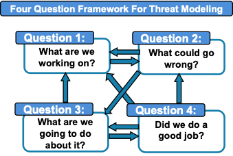

Appendix C: Threat Modeling Approach
====================================

As some genomic sequencers are classified as medical devices, the cybersecurity paper used the threat modeling approach described in the *Playbook for Threat Modeling Medical Devices (Playbook)* [1]_ based on methods described in the “Threat Modeling Manifesto” [2]_ and by Shostack [3]_. However, as noted above, privacy, though connected to cybersecurity, is distinct from it. Therefore, while this paper adheres to the high-level approaches of the Four Question Framework and the Threat Modeling Manifesto, it employs tools that are specific to privacy.

Four Question Framework
-----------------------

   Appendix Figure 1. Visualization of the Four Question Framework for Threat Modeling [2]_

This figure illustrates The Four Questions Framework for Threat Modeling. It starts with Question 1: What are we working on? From there, Question 2 is What could go wrong? Question 3 is What are we going to do about it? And Question 4 is Did we do a good job? The questions interconnect and will be revisited iteratively to improve the results.

It is expected that users of this process aiming to leverage the outputs documented in this paper will modify and adjust them to reflect differences between their environments and the baseline one described here. In particular, this threat model is intended for various stakeholders who have differing priorities with respect to the same threats. Organizations will choose specific responses, including interventions, depending on:

- their mission;

- their goals in performing the threat modeling process;

- the priorities that reflect their specific use case;

- the phase of the system life cycle; and

- the resources at their disposal.

Therefore, a comprehensive list of interventions and answers to Question 3 will not be provided in this paper. `Response Determination <../PTM/Question3.html#response-determination>`__ discusses the intervention identification process along with resources and an illustrative example. Individual organizations can also incorporate the threats into their risk modeling and assessment processes, addressing the resultant risks through elimination, mitigation, transfer, or acceptance.

Privacy Threat Modeling
-----------------------

Key characteristics of privacy threats are a superset of the characteristics of cybersecurity threats. Cybersecurity threats typically involve the actions of a malicious entity that is external to the system proper. This can be true of privacy threats as well, but not necessarily. While privacy threats can be active, they can also involve inactions, such as a failure to provide relevant information to direct data subjects or to obtain their consent for the collection and use of their data. Malicious privacy threats are certainly not unheard of, but privacy threats are just as often side effects of the pursuit of other objectives. Additionally, while threat actors can be external entities, sometimes it is the system itself, operating as designed, that poses the threat. One such privacy threat is insufficient de-identification, where the identity of an individual in a sensitive dataset, such as a rare disease database, can be determined using metadata and information from open-access or controlled-access genomic databases [Ref15]_.

As a result of these possibilities, privacy threat modeling must adopt a broader perspective than cybersecurity threat modeling. This broader perspective is reflected in the principal tools employed – the NIST PRAM [Ref1]_, LINDDUN [Ref2]_, and MITRE PANOPTIC [Ref3]_– each of which are described in the following subsections. Two of those tools, LINDDUN and PANOPTIC, were also selected because they roughly mirror the orientations of the tools – STRIDE [4]_ and MITRE ATT&CK [5]_ respectively – that were used for the cybersecurity threat modeling in NIST CSWP 35 [Ref6]_.

LINDDUN
~~~~~~~

LINDDUN [Ref2]_ is one of the earliest and most widely recognized privacy threat modeling tools. Inspired by STRIDE [4]_, the name is an acronym comprising seven different privacy threat types:

- Linking – Learning more about an individual (*or a group*) by associating related data items with one another

- Identifying – Identity of an individual can be learned through leaks, deduced, or inferred when that is undesirable

- Non-repudiation [1]_ – An individual is unable to deny certain claims pertaining to them as a result of data collected, data shared, or a system action taken by the individual or others

- Detecting – Becoming aware of an individual’s involvement, membership, or participation via observation of relevant information

- Data disclosure – Avoidable transfer of an individual’s data across a boundary, whether intended or unintended

- Unawareness and unintervenability – Insufficiently informing, involving, or empowering the individual with respect to their role and relation to the system

- Non-compliance – Lack of adherence to statutory or regulatory requirements or to standards or best practices

LINDDUN *[2]* heavily relies on DFDs, which are especially useful for data privacy analyses. Like STRIDE-per-Element [4]_, DFD elements vary in their relevance for different threat types. LINDDUN comes with a catalog of detailed threat trees that break down the high-level threat types into more granular threats that can be associated with specific DFD segments [Ref2]_.

MITRE PANOPTIC
~~~~~~~~~~~~~~~

Just as LINDDUN [Ref2]_ roughly mirrors STRIDE [4]_, PANOPTIC [Ref3]_ roughly mirrors MITRE ATT&CK [5]_. Like ATT&CK, PANOPTIC (Pattern and Action Nomenclature Of Privacy Threats In Context) was created from the bottom up based on real-world privacy attacks drawn from multiple sources. However, PANOPTIC looks and works rather differently. PANOPTIC consists of two closely related taxonomies: Contextual Domains (made up of contextual elements) and Privacy Activities (made up of privacy threat actions). The Contextual Domains, as the name suggests, capture important contextual aspects of the system of concern, including how it interacts with data subjects and the nature of the data. Privacy Activities describe the various components of a privacy attack and are a mixture of Fair Information Practice Principles, information life cycle stages such as collection and processing, and independent components such as identification. Contextual elements and privacy threat actions may have sub-elements and sub-actions respectively. *Table 23* lists the Contextual Domains and definitions while *Table 24* lists the Privacy Activities and definitions. [Ref2]_

.. table:: Table 23. PANOPTIC V2.0 Contextual Domains

   +--------+-----------------------+----------------------------------------------------------------------------------------------------------------------------------------------------------------------+
   | **ID** | **Contextual Domain** | **Definition**                                                                                                                                                       |
   +========+=======================+======================================================================================================================================================================+
   | PC01   | Environment           | The type of contextual domain in which data actions [3]_ occur                                                                                                       |
   +--------+-----------------------+----------------------------------------------------------------------------------------------------------------------------------------------------------------------+
   | PC02   | Distribution          | How many entities with which the information holder shares information                                                                                               |
   +--------+-----------------------+----------------------------------------------------------------------------------------------------------------------------------------------------------------------+
   | PC03   | Interaction           | The extent to which the data subject or their proxy interacts with the data custodian, processor, third-party, or their proxy (entities other than the data subject) |
   +--------+-----------------------+----------------------------------------------------------------------------------------------------------------------------------------------------------------------+
   | PC04   | Engagement            | Targeted subpopulations with which the entity or their proxy interact                                                                                                |
   +--------+-----------------------+----------------------------------------------------------------------------------------------------------------------------------------------------------------------+
   | PC05   | Data Type             | Classes of data upon which data actions are performed                                                                                                                |
   +--------+-----------------------+----------------------------------------------------------------------------------------------------------------------------------------------------------------------+

.. table:: Table 24. PANOPTIC V2.0 Privacy Activities

   +--------+-------------------------+-----------------------------------------------------------------------------------------------------------+
   | **ID** | **Privacy Activity**    | **Definition**                                                                                            |
   +========+=========================+===========================================================================================================+
   | PA01   | Notice                  | Informing the data subject or their proxy of one or more data actions                                     |
   +--------+-------------------------+-----------------------------------------------------------------------------------------------------------+
   | PA02   | Consent                 | Assent from the data subject or their proxy to one or more defined data actions                           |
   +--------+-------------------------+-----------------------------------------------------------------------------------------------------------+
   | PA03   | Collection              | The gathering or extraction of information                                                                |
   +--------+-------------------------+-----------------------------------------------------------------------------------------------------------+
   | PA04   | Insecurity              | Insufficient data protection controls                                                                     |
   +--------+-------------------------+-----------------------------------------------------------------------------------------------------------+
   | PA05   | Identification          | How information is associated with the data subject                                                       |
   +--------+-------------------------+-----------------------------------------------------------------------------------------------------------+
   | PA06   | Quality Assurance       | Implementing policies or processes to ensure quality throughout privacy-related activities                |
   +--------+-------------------------+-----------------------------------------------------------------------------------------------------------+
   | PA07   | Manageability [4]_      | Enabling the data subject or their proxy to access, modify, copy, or destroy information about themselves |
   +--------+-------------------------+-----------------------------------------------------------------------------------------------------------+
   | PA08   | Aggregation             | Assembling data from one or more sets of data                                                             |
   +--------+-------------------------+-----------------------------------------------------------------------------------------------------------+
   | PA09   | Processing              | Extracting and developing value and utility from information                                              |
   +--------+-------------------------+-----------------------------------------------------------------------------------------------------------+
   | PA10   | Sharing                 | Making information available to another entity                                                            |
   +--------+-------------------------+-----------------------------------------------------------------------------------------------------------+
   | PA11   | Use                     | Leveraging information to achieve a goal                                                                  |
   +--------+-------------------------+-----------------------------------------------------------------------------------------------------------+
   | PA12   | Retention & Destruction | Actions that affect the persistence of information                                                        |
   +--------+-------------------------+-----------------------------------------------------------------------------------------------------------+
   | PA13   | Deviations              | Data action diverges from established limits bounding the data action in question                         |
   +--------+-------------------------+-----------------------------------------------------------------------------------------------------------+

NIST Privacy Risk Assessment Methodology (PRAM)
~~~~~~~~~~~~~~~~~~~~~~~~~~~~~~~~~~~~~~~~~~~~~~~

The NIST PRAM [Ref1]_ is a product of NIST’s Privacy Engineering Program. It is a multi-step process for identifying system privacy risks and is supported by a set of four worksheets:

1. Framing Business Objectives & Organizational Privacy Governance

2. Assessing System Design (includes separate Supporting Data Map)

3. Prioritizing Risk

4. Selecting Controls

The PRAM also leverages a non-exhaustive privacy risk model consisting of defined “Problematic Data Actions” – particular manifestations of the higher-level data actions corresponding to stages of the information life cycle [5]_, which could enable adverse effects for individuals – and “Problems for Individuals,” those adverse consequences. The PRAM is intended to help ensure systems reflect the PEOs listed in `Privacy Overview <../Introduction.html#privacy-overview>`__.

As a risk modeling tool, the PRAM is broader than threat modeling. However, aspects of it can be readily adapted to directly accommodate privacy threat modeling. Therefore, the first two worksheets enumerated above were modified as necessary and used as the principal means of documenting the threat modeling described in this paper.

Organizational Tailoring
------------------------

Organizations that process genomic data need to protect that data due to its high value and the privacy risk to individuals. Organizations need a process to guide the selection of appropriate capabilities to reduce privacy risk to an acceptable level for the predictability, manageability, and disassociability of systems that process genomic data. Each organization should consider its own goals and priorities when tailoring this example to select and implement appropriate and cost-effective privacy capabilities and threat interventions. The organization should also periodically reassess its privacy posture and update its threat modeling as necessary, considering new technologies and threats to identify gaps and reprioritize interventions.

NIST IR 8467, the *Genomic Data Profile* [Ref4]_ , provides a prioritized list of Mission Objectives (MOs) for organizations processing genomic data and prioritizes NIST Privacy Framework (PF) version 1.0 Subcategories (or outcomes) to support achieving those MOs. Based on the workflow of sequencing genomic material, the NCCoE team selected four relevant MOs from the *Genomic Data Profile* [Ref4]_, shown in *Table 25.* However, depending on their context, organizations may choose to prioritize an alternative set of MOs.

.. table:: Table 25. Selected Genomic Sequencing Workflow Mission Objectives

   +-------------------------------------------------+-----------------------------------------------------------------------------------------------------------+
   | Mission Objective from the Genomic Data Profile | Mission Objective Description                                                                             |
   +=================================================+===========================================================================================================+
   | 2                                               | Manage privacy risk to existing and future relatives                                                      |
   +-------------------------------------------------+-----------------------------------------------------------------------------------------------------------+
   | 3                                               | Identify, model, and address cybersecurity and privacy risks of processing genomic data                   |
   +-------------------------------------------------+-----------------------------------------------------------------------------------------------------------+
   | 5                                               | Manage privacy risk to donors                                                                             |
   +-------------------------------------------------+-----------------------------------------------------------------------------------------------------------+
   | 12                                              | Promote the use of privacy-enhancing technologies as well as secure technologies for sharing genomic data |
   +-------------------------------------------------+-----------------------------------------------------------------------------------------------------------+

When answering Question 3 (What are we going to do about it?) of the Four Question Framework these MOs can be used to prioritize potential controls that might be employed to disrupt threats.

.. [1]
   The MITRE Corporation and Medical Device Innovation Consortium (MDIC) (2021) Playbook for Threat Modeling Medical Devices. Available at https://www.mitre.org/sites/default/files/2021-11/Playbook-for-Threat-Modeling-Medical-Devices.pdf 

.. [2]
   Shostack A (2014) Threat Modeling: Designing for Security (Wiley, Hoboken, NJ) 1st Ed. Available at https://www.wiley.com/en-us/Threat+Modeling%3A+Designing+Security-p-9781118809990 

.. [3]
   https://shostack.org/about/adam

.. [4]
   The STRIDE Threat Model. Available at https://learn.microsoft.com/en-us/previous-versions/commerce-server/ee823878(v=cs.20)?redirectedfrom=MSDN  

.. [5]
   MITRE ATT&CK. Available at https://attack.mitre.org/