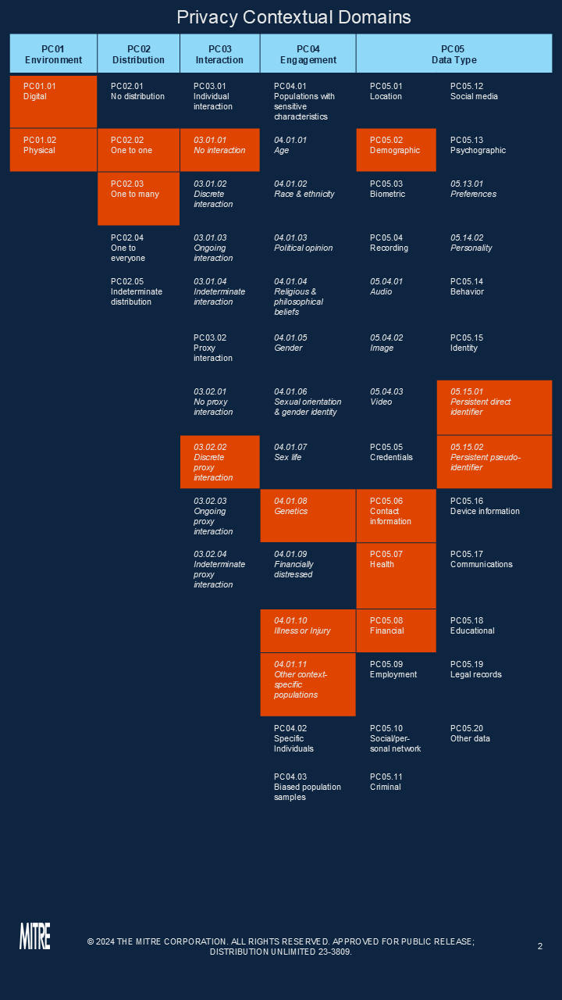
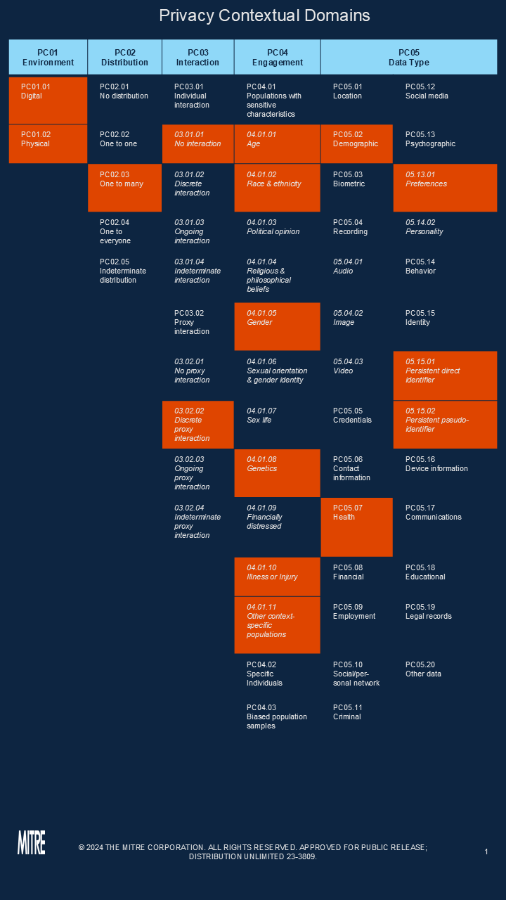
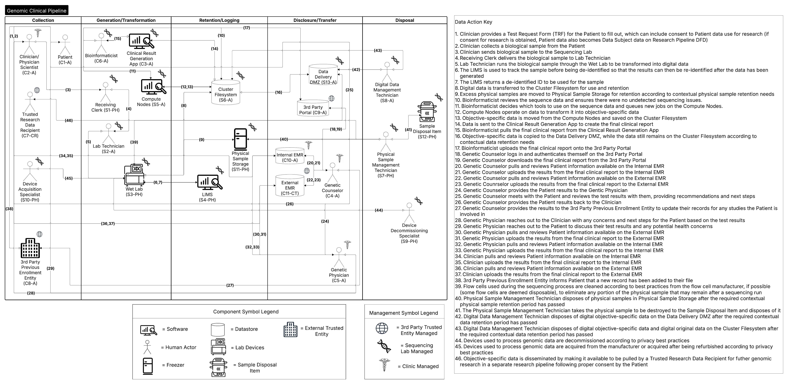
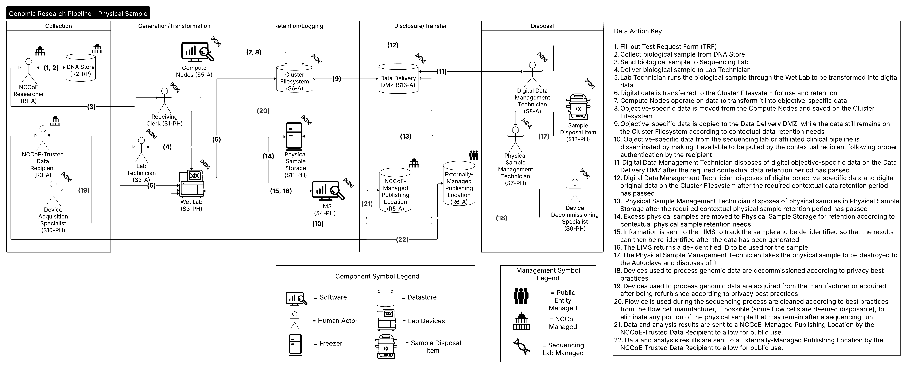
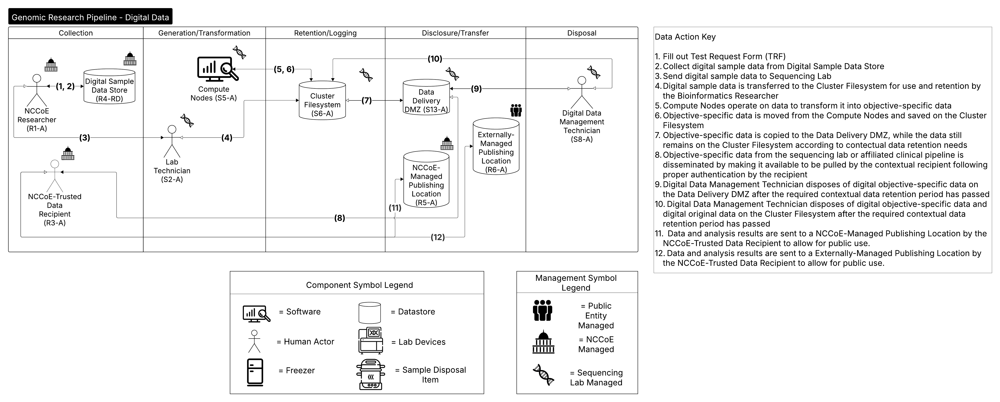
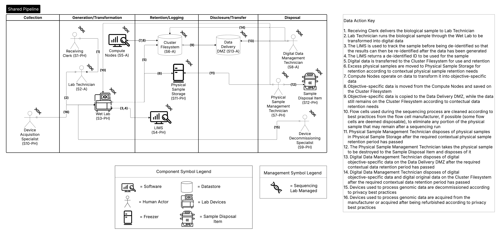

Appendix E: System Description
==============================

This appendix presents the system context for the complete example in the form of individual PANOPTIC contextual mappings for the clinical and research uses cases and multiple dataflow diagrams. The dataflow diagrams distinguish between the clinical use case, the research use case for physical versus digital samples, and dataflows shared by the use cases.

PANOPTIC Contextual Mapping for Clinical Use Case
-------------------------------------------------

PANOPTIC Contextual Mapping for Research Use Case
-------------------------------------------------

Dataflow Diagram Legend 
-----------------------

Table 25. Symbols Used in Detailed DFDs

.. table:: Table 2. Symbols Used in Detailed DFDsData Flow Diagrams (DFDs) created by the team to document their work, showing trust boundaries and communication paths. These diagrams support STRIDE threat analysis and help create a common architecture document for collaboration. They follow conventions

   +-----------------+------------------------------------------------------------------------------------------------+------------------------------------------------------------------------------------------------------------------------------------------------------------------------------------------+
   | **Element**     | **Symbol**                                                                                     | **Discussion**                                                                                                                                                                           |
   +=================+================================================================================================+==========================================================================================================================================================================================+
   | External Entity | .. image:: media/Appendix-DFDTable-Icon1.png                                                   | **Object:** A sharp-cornered rectangle.                                                                                                                                                  |
   |                 |                                                                                                |                                                                                                                                                                                          |
   |                 |                                                                                                | **Represents:** Anything outside your control. Examples include people and systems run by other organizations or even divisions.                                                         |
   +-----------------+------------------------------------------------------------------------------------------------+------------------------------------------------------------------------------------------------------------------------------------------------------------------------------------------+
   | Process         | .. image:: media/Appendix-DFDTable-Icon2.png                                                   | **Object:** A rounded rectangle.                                                                                                                                                         |
   |                 |                                                                                                |                                                                                                                                                                                          |
   |                 |                                                                                                | **Represents:** Any digital or physical process that generates or manipulates data, including running code, scripts, shell commands, Structured Query Language (SQL) queries, et cetera. |
   +-----------------+------------------------------------------------------------------------------------------------+------------------------------------------------------------------------------------------------------------------------------------------------------------------------------------------+
   | Data Store      | .. image:: media/Appendix-DFDTable-Icon3.png                                                   | **Object:** A drum.                                                                                                                                                                      |
   |                 |                                                                                                |                                                                                                                                                                                          |
   |                 |                                                                                                | **Represents:** Anywhere data are stored, including files, databases, shared memory, cloud storage services, cookies, et cetera.                                                         |
   +-----------------+------------------------------------------------------------------------------------------------+------------------------------------------------------------------------------------------------------------------------------------------------------------------------------------------+
   | Dataflows       | .. image:: media/Appendix-DFDTable-Icon4.png                                                   | **Object:** A double-headed arrow.                                                                                                                                                       |
   |                 |                                                                                                |                                                                                                                                                                                          |
   |                 |                                                                                                | **Represents:** All the ways that components can exchange data with one another. If a flow is unidirectional, you can represent the sending side as an empty arrow.                      |
   +-----------------+------------------------------------------------------------------------------------------------+------------------------------------------------------------------------------------------------------------------------------------------------------------------------------------------+
   | Human Actor     | .. image:: media/Appendix-DFDTable-Icon5.png                                                   | **Object:** A stick figure.                                                                                                                                                              |
   |                 |                                                                                                |                                                                                                                                                                                          |
   |                 |                                                                                                | **Represents:** Any human actor in the environment.                                                                                                                                      |
   +-----------------+------------------------------------------------------------------------------------------------+------------------------------------------------------------------------------------------------------------------------------------------------------------------------------------------+

Each two-dimensional object with solid lines represents a **component**. All lines connecting components represent **dataflows** that can be either digital or physical (such as a network connection or a human inserting a physical sample into a sequencer). Dataflows are shown as double-headed arrows. A **hollow arrow** on one side of a given dataflow implies that the component on that side of the dataflow is the exclusive source.

Dataflow Diagram for Clinical Use Case
--------------------------------------

 
Dataflow Diagram for Research Physical Use Case
-----------------------------------------------

Dataflow Diagram for Research Digital Use Case
----------------------------------------------

Shared Dataflow Diagram
-----------------------

