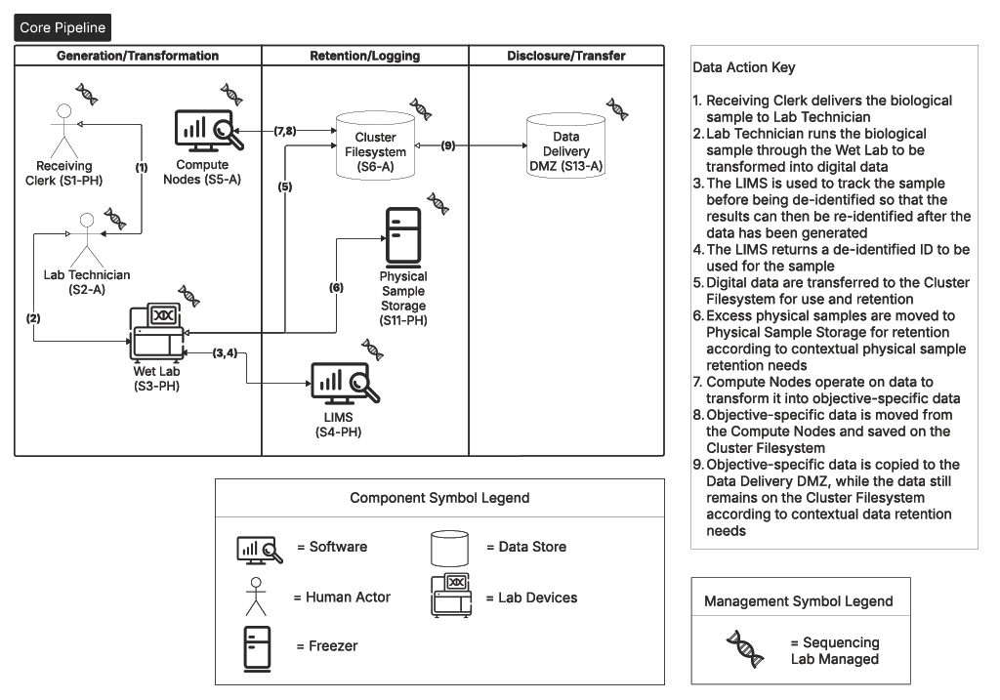

Question 1: "What are we working on?"
=====================================

Answering Question 1 helps teams identify activities and describe the system(s) being developed or analyzed. Because privacy is contextual, it is important to explicitly document that context in terms of the system and its surrounding environment. With this initial context, which may change over time, a more formalized description of system operation can be developed. The context is captured in a semi-structured fashion while augmented and annotated DFDs are used for the operational description.

The NCCoE Genomic Data Cybersecurity and Privacy project team documented the context and operational parameters by reviewing the workflow described in Figure 1, interviewing associated personnel, analyzing architecture documents, and building out the workflow to develop a shared understanding of the system environment, components, functionality, and interfaces. Through this process, the team established a baseline understanding to support analyzing genomic data threats regarding privacy and identifying potential interventions.

Context
-------

For this analysis, context is considered along the broad dimensions of system and environmental. Relatedly, the NIST PRAM introduces the term contextual factors including system, individual, and organizational [Ref1]_. Systems typically exist in a larger environment of requirements or expectations. At the same time, systems will reflect environmental context with certain privacy commitments, approaches, and goals. An understanding of the environmental and system dimensions is necessary to provide a basis for threat modeling, especially for interpretations and judgments involved in determining what could go wrong (`Question 2 <Question2.html>`_).

Environmental Context
---------------------

NIST Privacy Risk Assessment Methodology (PRAM) [Ref1]_ Worksheet 1 (Framing Business Objectives & Organizational Privacy Governance) is used together with elements of an adapted Worksheet 2 (Assessing System Design) to capture environmental context, primarily from the perspective of the sequencing service. Worksheet 1 focuses on the implementing organization(s) and is divided into two tasks: (1) frame organizational objectives and (2) frame organizational privacy governance, each of which consists of a series of questions and free form answers. Task 1 addresses business objectives and functional capabilities while Task 2 accounts for the governance structure that informs, enables, and constrains the system. These are environmental concerns because even though in principle they manifest themselves through the system, they are conditions that are external to the system. 

Table 1 presents the Worksheet 1, Task 1 questions and responses. Table 2 presents the Task 2 questions and responses. Note that questions in Task 1 address overarching need and goals; responses therefore pertain to the *complete* example rather than solely the *core*.

.. table:: Table 1. PRAM Worksheet 1, Framing Business Objectives & Organizational Privacy Governance: Task 1 Questions and Responses

   +----------------------------------------------------------------------------------------------------------------------------------------------+
   | **1. Describe the mission/business needs that your system/product/service serves.**                                                          |
   +==============================================================================================================================================+
   | *Clinical Pipeline*                                                                                                                          |
   |                                                                                                                                              |
   | Participating entities need to:                                                                                                              |
   |                                                                                                                                              |
   | - Treat patients and provide genetic counseling                                                                                              |
   |                                                                                                                                              |
   | - Sequence their DNA to generate clinical results                                                                                            |
   |                                                                                                                                              |
   | - Deliver results to the patient and physician while ensuring patient privacy                                                                |
   |                                                                                                                                              |
   | *Research Pipeline*                                                                                                                          |
   |                                                                                                                                              |
   | Participating entities need to:                                                                                                              |
   |                                                                                                                                              |
   | - Sequence provided DNA to generate research insights                                                                                        |
   |                                                                                                                                              |
   | - Deliver results to trusted research entity                                                                                                 |
   +----------------------------------------------------------------------------------------------------------------------------------------------+
   | **2. Describe the functional needs or capabilities of your system/product/service.**                                                         |
   +----------------------------------------------------------------------------------------------------------------------------------------------+
   | *Clinical Pipeline*                                                                                                                          |
   |                                                                                                                                              |
   | Clinicians need:                                                                                                                             |
   |                                                                                                                                              |
   | - Sample intake protections and procedures (clinical form, test request form or TRF)                                                         |
   |                                                                                                                                              |
   | Sequencing service needs to:                                                                                                                 |
   |                                                                                                                                              |
   | - Maintain a proper chain of custody of the sample and associated data                                                                       |
   |                                                                                                                                              |
   | - Ensure the confidentiality of all patients by securing their data at rest using appropriate encryption                                     |
   |                                                                                                                                              |
   | - Use proper bioinformatics data analysis pipelines that do not leak private data                                                            |
   |                                                                                                                                              |
   | - Ensure the privacy of patients by securing their in-transit data using appropriate encryption                                              |
   |                                                                                                                                              |
   | - Securely disseminate resultsRetain or properly destroy data                                                                                |
   |                                                                                                                                              |
   | - Maintain consent                                                                                                                           |
   |                                                                                                                                              |
   | *Research Pipeline*                                                                                                                          |
   |                                                                                                                                              |
   | Sequencing service needs to:                                                                                                                 |
   |                                                                                                                                              |
   | - Maintain consent to research                                                                                                               |
   |                                                                                                                                              |
   | - Maintain a proper chain of custody of the sample and associated data                                                                       |
   |                                                                                                                                              |
   | - Ensure the privacy of all direct data subjects by securing their data at rest                                                              |
   |                                                                                                                                              |
   | - Use proper bioinformatics tools that do not leak private data                                                                              |
   |                                                                                                                                              |
   | - Ensure the privacy of direct data subjects by securing their in-transit data                                                               |
   |                                                                                                                                              |
   | - Securely disseminate results                                                                                                               |
   |                                                                                                                                              |
   | - Retain or properly destroy data                                                                                                            |
   +----------------------------------------------------------------------------------------------------------------------------------------------+
   | **3. Describe any privacy-preserving goals for your system/product/service that you may plan to highlight or market to users or customers.** |
   +----------------------------------------------------------------------------------------------------------------------------------------------+
   | *Clinical Pipeline*                                                                                                                          |
   |                                                                                                                                              |
   | Sequencing service will:                                                                                                                     |
   |                                                                                                                                              |
   | - Pseudonymize patient data while engaging in sequencing activities                                                                          |
   |                                                                                                                                              |
   | - Preserve the privacy of patients and protect their data throughout the clinical pipeline                                                   |
   |                                                                                                                                              |
   | *Research Pipeline*                                                                                                                          |
   |                                                                                                                                              |
   | Sequencing service will:                                                                                                                     |
   |                                                                                                                                              |
   | - Pseudonymize direct data subjects’ data to relevant standards (e.g., HIPAA Safe Harbor or expert determination)                            |
   |                                                                                                                                              |
   | - Preserve the privacy of direct data subjects and protect their data throughout the research pipeline                                       |
   |                                                                                                                                              |
   | - Protect research results (e.g., treatment personalization approach) within the research pipeline                                           |
   +----------------------------------------------------------------------------------------------------------------------------------------------+

.. table:: Table 2. PRAM Worksheet 1, Framing Business Objectives & Organizational Privacy Governance: Task 2 Questions and Responses

   +------------------------------------------------------------------------------------------------------------------------------------------------------------------------------------------------------------+
   | **1. Legal Environment: Identify any privacy-related statutory, regulatory, contractual and/or other frameworks within which the organization must operate. List any specific privacy requirements.**      |
   +============================================================================================================================================================================================================+
   | Include:                                                                                                                                                                                                   |
   |                                                                                                                                                                                                            |
   | - Health Insurance Portability and Accountability Act of 1996 (HIPAA) Privacy Rule, including Protected Health Information (PHI) [7]_                                                                      |
   |                                                                                                                                                                                                            |
   | - Genetic Information Nondiscrimination Act of 2008                                                                                                                                                        |
   |                                                                                                                                                                                                            |
   | - Clinical Laboratory Improvement Amendments (CLIA) [8]_                                                                                                                                                   |
   |                                                                                                                                                                                                            |
   | - College of American Pathologists (CAP) [9]_                                                                                                                                                              |
   |                                                                                                                                                                                                            |
   | - European Union General Data Protection Regulation (GDPR)                                                                                                                                                 |
   |                                                                                                                                                                                                            |
   | - State (e.g., California Consumer Privacy Act, Alabama HB21 Genetic Data)                                                                                                                                 |
   |                                                                                                                                                                                                            |
   | - Applicable National Institutes of Health (NIH) requirements and regulations                                                                                                                              |
   |                                                                                                                                                                                                            |
   | - The Common Rule (45 CFR 46, U.S.) – Federal regulations that:                                                                                                                                            |
   |                                                                                                                                                                                                            |
   |   - Mandate Institutional Review Board (IRB) oversight                                                                                                                                                     |
   |                                                                                                                                                                                                            |
   |   - Require informed consent procedures                                                                                                                                                                    |
   |                                                                                                                                                                                                            |
   |   - Provide additional protections for vulnerable groups like children and prisoners                                                                                                                       |
   |                                                                                                                                                                                                            |
   | - Grant-specific privacy requirements                                                                                                                                                                      |
   +------------------------------------------------------------------------------------------------------------------------------------------------------------------------------------------------------------+
   | **2. Identify any privacy-related principles or other commitments to which the organization adheres (e.g., Fair Information Practice Principles, Privacy by Design principles, ethics principles).**       |
   +------------------------------------------------------------------------------------------------------------------------------------------------------------------------------------------------------------+
   | - Accreditation requirements (CLIA/CAP)                                                                                                                                                                    |
   |                                                                                                                                                                                                            |
   | - NIH Data User Code of Conduct [10]_                                                                                                                                                                      |
   |                                                                                                                                                                                                            |
   | - Food and Drug Administration (FDA) Genomic Sampling and Management of Genomic Data Guidance for Industry [11]_                                                                                           |
   |                                                                                                                                                                                                            |
   | - Medical and research ethics (IRB)                                                                                                                                                                        |
   |                                                                                                                                                                                                            |
   | - Good clinical practice (GCP)                                                                                                                                                                             |
   +------------------------------------------------------------------------------------------------------------------------------------------------------------------------------------------------------------+
   | **3. Identify any privacy goals that are explicit or implicit in the organization’s vision and/or mission.**                                                                                               |
   +------------------------------------------------------------------------------------------------------------------------------------------------------------------------------------------------------------+
   | - Ensure the privacy of all individuals by protecting their data                                                                                                                                           |
   +------------------------------------------------------------------------------------------------------------------------------------------------------------------------------------------------------------+
   | **4. Identify any privacy-related policies or statements within the organization, or business unit.**                                                                                                      |
   +------------------------------------------------------------------------------------------------------------------------------------------------------------------------------------------------------------+
   | - Limit sharing of individuals’ data by limiting access to only those with a need to know                                                                                                                  |
   |                                                                                                                                                                                                            |
   | - Vet privacy practices of third parties who are used for outside services and hosting                                                                                                                     |
   |                                                                                                                                                                                                            |
   | - Keep all privacy training documents up to date as well as ensure staff regularly receive training                                                                                                        |
   |                                                                                                                                                                                                            |
   | - Handling policies of samples and data reflect privacy obligations                                                                                                                                        |
   +------------------------------------------------------------------------------------------------------------------------------------------------------------------------------------------------------------+
   | **5. Document your organization’s risk tolerance with respect to privacy from your organization’s enterprise risk management strategy.**                                                                   |
   +------------------------------------------------------------------------------------------------------------------------------------------------------------------------------------------------------------+
   | The following are considered untenable:                                                                                                                                                                    |
   |                                                                                                                                                                                                            |
   | -  Risk from third parties absent specific legal constraints                                                                                                                                               |
   |                                                                                                                                                                                                            |
   | -  Individuals’ data are mixed with data or entered into systems not directly related to sample processing (e.g., administrative)                                                                          |
   +------------------------------------------------------------------------------------------------------------------------------------------------------------------------------------------------------------+

PRAM Worksheet 2 (Assessing System Design) captures contextual factors that go beyond the organization itself, situating it within the larger environment and in relation to affected individuals. Table 3 presents the organizational contextual factors for the clinical and research use cases while Table 4 presents the contextual factors for individuals. As with Worksheet 1, these apply to the complete example.

.. table:: Table 3. PRAM Worksheet 2, Assessing System Design: Organizational Contextual Factors

   +-----------------------------------------------------------------------------------------------------------------------------------------------------------------------------------------------------------------------------------------------------------------------------------------------+
   | **Clinical Use Case**                                                                                                                                                                                                                                                                         |
   +===============================================================================================================================================================================================================================================================================================+
   | Organizations include a private clinic or other healthcare provider and a non-profit genomic sequencing/bioinformatics laboratory in this example                                                                                                                                             |
   +-----------------------------------------------------------------------------------------------------------------------------------------------------------------------------------------------------------------------------------------------------------------------------------------------+
   | Public perception: Especially high expectation of privacy for all organizations handling genomic data in a clinical setting                                                                                                                                                                   |
   +-----------------------------------------------------------------------------------------------------------------------------------------------------------------------------------------------------------------------------------------------------------------------------------------------+
   | Relationships: Patient has no pre-existing relationship with the genomic sequencing/bioinformatics laboratory and has interacted with the private clinic or other healthcare provider by providing their data/sample along with their consent for use of the data/sample for clinical testing |
   +-----------------------------------------------------------------------------------------------------------------------------------------------------------------------------------------------------------------------------------------------------------------------------------------------+
   | **Research Use Case**                                                                                                                                                                                                                                                                         |
   +-----------------------------------------------------------------------------------------------------------------------------------------------------------------------------------------------------------------------------------------------------------------------------------------------+
   | Organizations include a national research organization and a non-profit genomic sequencing/bioinformatics laboratory in this example                                                                                                                                                          |
   +-----------------------------------------------------------------------------------------------------------------------------------------------------------------------------------------------------------------------------------------------------------------------------------------------+
   | Public perception: High expectation of privacy for all organizations handling genomic data                                                                                                                                                                                                    |
   +-----------------------------------------------------------------------------------------------------------------------------------------------------------------------------------------------------------------------------------------------------------------------------------------------+
   | Relationships: Data subject has no pre-existing relationship with the genomic sequencing/bioinformatics laboratory and has interacted with the national research organization by providing their data/sample along with their consent for use of the data/sample for research                 |
   +-----------------------------------------------------------------------------------------------------------------------------------------------------------------------------------------------------------------------------------------------------------------------------------------------+

.. table:: Table 4. Worksheet 2, Assessing System Design: Contextual Factors for Individuals

   +-------------------------------------------------------------------------------------------------------------------------------------------------------------------+
   | **Clinical Use Case**                                                                                                                                             |
   +===================================================================================================================================================================+
   | High sensitivity about genomic data/physical samples; individual and their relatives could all be affected                                                        |
   +-------------------------------------------------------------------------------------------------------------------------------------------------------------------+
   | Patients’ levels of technical sophistication and understanding of genomic sequencing and how it is used in clinical care decisions vary widely                    |
   +-------------------------------------------------------------------------------------------------------------------------------------------------------------------+
   | Potential patient misunderstanding regarding what organization(s) will have access to their genomic data when providing additional consent for research           |
   +-------------------------------------------------------------------------------------------------------------------------------------------------------------------+
   | Potential patient misunderstanding regarding personal and familial impacts of genomic data                                                                        |
   +-------------------------------------------------------------------------------------------------------------------------------------------------------------------+
   | **Research Use Case**                                                                                                                                             |
   +-------------------------------------------------------------------------------------------------------------------------------------------------------------------+
   | High sensitivity about genomic data/physical samples; individual and their relatives could all be affected                                                        |
   +-------------------------------------------------------------------------------------------------------------------------------------------------------------------+
   | Data subjects’ levels of technical sophistication and understanding of genomic research vary widely                                                               |
   +-------------------------------------------------------------------------------------------------------------------------------------------------------------------+
   | Potential direct data subject misunderstanding regarding what organization(s) will have access to their genomic data when providing initial consent for research  |
   +-------------------------------------------------------------------------------------------------------------------------------------------------------------------+
   | Pseudonymized or acceptable aggregate research results are intended to be made public, according to the specifics of the consent provided by direct data subjects |
   +-------------------------------------------------------------------------------------------------------------------------------------------------------------------+

System Context
--------------

The team described the system context using two complementary approaches: an adapted PRAM Worksheet 2 and the PANOPTIC Contextual Domains. PRAM Worksheet 2 addresses system privacy capabilities and other contextual factors for the complete example. As a controlled taxonomy, PANOPTIC provides a structured and granular description of system context for the complete example, including categories of data, that complements the information captured by Worksheet 2. Worksheet 2 addresses system privacy capabilities and other contextual factors for the complete example. System capabilities—in terms of the PEOs of predictability, manageability, and disassociability—are presented in Table 5 and Table 6 for the clinical and research use cases respectively. Worksheet 2 contextual factors are presented in Table7 for both the clinical and research use cases. 

.. table:: Table 5. PRAM Worksheet 2, Assessing System Design: System Privacy Capabilities for Clinical Use Case

   +-----------------------------------------------------------------------------------------------------------------------------------------------------------------------------------+
   | **Predictability**                                                                                                                                                                |
   +===================================================================================================================================================================================+
   | Patient’s data is only used for clinical efforts according to the specifics of their provided consent                                                                             |
   +-----------------------------------------------------------------------------------------------------------------------------------------------------------------------------------+
   | Patient’s data is appropriately pseudonymized during sequencing service use                                                                                                       |
   +-----------------------------------------------------------------------------------------------------------------------------------------------------------------------------------+
   | **Manageability**                                                                                                                                                                 |
   +-----------------------------------------------------------------------------------------------------------------------------------------------------------------------------------+
   | Patient is able to provide consent for their data to be used that specifies the type(s) of clinical uses that are consented to                                                    |
   +-----------------------------------------------------------------------------------------------------------------------------------------------------------------------------------+
   | Patient can, at any time, request information about how their data is being used for clinical purposes                                                                            |
   +-----------------------------------------------------------------------------------------------------------------------------------------------------------------------------------+
   | Patient can, at any time, withdraw consent for their data being used for clinical purposes                                                                                        |
   +-----------------------------------------------------------------------------------------------------------------------------------------------------------------------------------+
   | **Disassociability**                                                                                                                                                              |
   +-----------------------------------------------------------------------------------------------------------------------------------------------------------------------------------+
   | Digital genomic data provided for clinical uses have been pseudonymized, allowing for the data to be used in the lab without associating the genomic data directly with a patient |
   +-----------------------------------------------------------------------------------------------------------------------------------------------------------------------------------+

.. table:: Table 6. PRAM Worksheet 2, Assessing System Design: System Privacy Capabilities for Research Use Case

   +-----------------------------------------------------------------------------------------------------------------------------------------------------------------------------------------------------------------------------------------------------------------------------------------------------------------+
   | **Predictability**                                                                                                                                                                                                                                                                                              |
   +=================================================================================================================================================================================================================================================================================================================+
   | Direct data subject’s data is only used for research efforts according to the specifics of their provided consent                                                                                                                                                                                               |
   +-----------------------------------------------------------------------------------------------------------------------------------------------------------------------------------------------------------------------------------------------------------------------------------------------------------------+
   | Direct data subject’s data is pseudonymized prior to use in research or acceptable aggregate statistics are used in research                                                                                                                                                                                    |
   +-----------------------------------------------------------------------------------------------------------------------------------------------------------------------------------------------------------------------------------------------------------------------------------------------------------------+
   | **Manageability**                                                                                                                                                                                                                                                                                               |
   +-----------------------------------------------------------------------------------------------------------------------------------------------------------------------------------------------------------------------------------------------------------------------------------------------------------------+
   | Direct data subject is able to provide consent for their data to be used for research, including more fine-grained consent, if desired, that specifies the type(s) of research that are consented to                                                                                                            |
   +-----------------------------------------------------------------------------------------------------------------------------------------------------------------------------------------------------------------------------------------------------------------------------------------------------------------+
   | Direct data subject can, at any time, request information about how their data is being used for research                                                                                                                                                                                                       |
   +-----------------------------------------------------------------------------------------------------------------------------------------------------------------------------------------------------------------------------------------------------------------------------------------------------------------+
   | Direct data subject can, at any time, withdraw consent for their data being used for research                                                                                                                                                                                                                   |
   +-----------------------------------------------------------------------------------------------------------------------------------------------------------------------------------------------------------------------------------------------------------------------------------------------------------------+
   | **Disassociability**                                                                                                                                                                                                                                                                                            |
   +-----------------------------------------------------------------------------------------------------------------------------------------------------------------------------------------------------------------------------------------------------------------------------------------------------------------+
   | Digital genomic data provided for research has had direct identifiers removed and cannot be analyzed at the individual subject level, allowing for the data to be used for research projects without associating the genomic data with the direct data subject                                                  |
   +-----------------------------------------------------------------------------------------------------------------------------------------------------------------------------------------------------------------------------------------------------------------------------------------------------------------+
   | Research results do not include genomic data that could be analyzed at the individual subject level                                                                                                                                                                                                             |
   +-----------------------------------------------------------------------------------------------------------------------------------------------------------------------------------------------------------------------------------------------------------------------------------------------------------------+
   | The non-profit sequencing service can carry out research tasks and analyses without associating a direct data subject with the provided sample                                                                                                                                                                  |
   +-----------------------------------------------------------------------------------------------------------------------------------------------------------------------------------------------------------------------------------------------------------------------------------------------------------------+
   | The national research organization can review the results provided by the non-profit sequencing service and will not be able to connect them back to a direct data subject                                                                                                                                      |
   +-----------------------------------------------------------------------------------------------------------------------------------------------------------------------------------------------------------------------------------------------------------------------------------------------------------------+
   | While the nature of genomic data makes complete disassociability impossible to guarantee, accepted practices – releasing results that cannot be analyzed at the individual subject level and maintaining direct subject data in controlled access repositories - are used to allow research use of genomic data |
   +-----------------------------------------------------------------------------------------------------------------------------------------------------------------------------------------------------------------------------------------------------------------------------------------------------------------+
   | Digital genomic data provided for research have been pseudonymized and cannot be analyzed at the individual subject level, allowing for the data to be used for research projects without associating the genomic data with a direct data subject                                                               |
   +-----------------------------------------------------------------------------------------------------------------------------------------------------------------------------------------------------------------------------------------------------------------------------------------------------------------+

.. table:: Table 7. PRAM Worksheet 2, Assessing System Design: System Contextual Factors

   +-----------------------------------------------------------------------------------------------------------------------------------------------------------------------------------------------------------------------------------------------------------------------------------------------------------------------------------+
   | **Clinical Use Case**                                                                                                                                                                                                                                                                                                             |
   +===================================================================================================================================================================================================================================================================================================================================+
   | System includes a private clinic or other healthcare provider and a non-profit genomic sequencing/bioinformatics laboratory                                                                                                                                                                                                       |
   +-----------------------------------------------------------------------------------------------------------------------------------------------------------------------------------------------------------------------------------------------------------------------------------------------------------------------------------+
   | Privacy policies governs system                                                                                                                                                                                                                                                                                                   |
   +-----------------------------------------------------------------------------------------------------------------------------------------------------------------------------------------------------------------------------------------------------------------------------------------------------------------------------------+
   | Public perception: Especially high expectation of privacy for all organizations handling genomic data in a clinical setting                                                                                                                                                                                                       |
   +-----------------------------------------------------------------------------------------------------------------------------------------------------------------------------------------------------------------------------------------------------------------------------------------------------------------------------------+
   | Relationships: Patient has no pre-existing relationship with the genomic sequencing/bioinformatics laboratory and has interacted with the private clinic or other healthcare provider by providing their data/sample along with their consent for use of the data/sample for clinical testing                                     |
   +-----------------------------------------------------------------------------------------------------------------------------------------------------------------------------------------------------------------------------------------------------------------------------------------------------------------------------------+
   | **Research Use Case**                                                                                                                                                                                                                                                                                                             |
   +-----------------------------------------------------------------------------------------------------------------------------------------------------------------------------------------------------------------------------------------------------------------------------------------------------------------------------------+
   | Research results not containing identifiable information are intended to be made public, according to the specifics of the consent provided by the direct data subjects                                                                                                                                                           |
   +-----------------------------------------------------------------------------------------------------------------------------------------------------------------------------------------------------------------------------------------------------------------------------------------------------------------------------------+
   | History with system: Direct data subject has already provided to the national research organization their data/sample along with consent for research use of the data/sample; data subject has no pre-existing relationship with the sequencing service; system has similarity to other publicly funded genomics research systems |
   +-----------------------------------------------------------------------------------------------------------------------------------------------------------------------------------------------------------------------------------------------------------------------------------------------------------------------------------+
   | Two parties involved: One public, one non-profit                                                                                                                                                                                                                                                                                  |
   +-----------------------------------------------------------------------------------------------------------------------------------------------------------------------------------------------------------------------------------------------------------------------------------------------------------------------------------+
   | Genomic sequencing/bioinformatics lab may use third party bioinformatics tools during data analysis if required to produce the necessary data for the research project                                                                                                                                                            |
   +-----------------------------------------------------------------------------------------------------------------------------------------------------------------------------------------------------------------------------------------------------------------------------------------------------------------------------------+

Similarly, separate PANOPTIC contextual mappings were constructed for the clinical and research use cases. We present these textually in Table 8 and Table 9 rather than in their original graphical forms, which can be found in `Appendix D <../Appendix/appendixD.html>`_. 

.. table:: Table 8. PANOPTIC Contextual Mapping for Clinical Use Case
   
   +----------------+------------------------------+------------------------------------------------------------------------------------------------------------------------------------------------------------------------------+---------------------------------------------------------------+
   | **Contextual** | **Contextual**               | **PANOPTIC Definition**                                                                                                                                                      | **Comment**                                                   |
   |                |                              |                                                                                                                                                                              |                                                               |
   | **Domain**     | **Element/**                 |                                                                                                                                                                              |                                                               |
   |                |                              |                                                                                                                                                                              |                                                               |
   |                | **Sub-element**              |                                                                                                                                                                              |                                                               |
   +================+==============================+==============================================================================================================================================================================+===============================================================+
   | Environment    | PC01.01 Digital              | Data action in a digital environment                                                                                                                                         |                                                               |
   +----------------+------------------------------+------------------------------------------------------------------------------------------------------------------------------------------------------------------------------+---------------------------------------------------------------+
   | Environment    | PC01.02 Physical             | Data action in a physical environment, including physical processes such as filling out a paper form                                                                         |                                                               |
   +----------------+------------------------------+------------------------------------------------------------------------------------------------------------------------------------------------------------------------------+---------------------------------------------------------------+
   | Distribution   | PC02.02 One to one           | Data custodian shares information with one other entity                                                                                                                      |                                                               |
   +----------------+------------------------------+------------------------------------------------------------------------------------------------------------------------------------------------------------------------------+---------------------------------------------------------------+
   | Distribution   | PC02.03 One to many          | Data custodian shares information with a discrete number of other entities [12]_                                                                                             |                                                               |
   +----------------+------------------------------+------------------------------------------------------------------------------------------------------------------------------------------------------------------------------+---------------------------------------------------------------+
   | Interaction    | PC03.01.01 No interaction    | Data subject does not directly interact at all with the entity or their proxy                                                                                                | Applies to indirect data subjects                             |
   +----------------+------------------------------+------------------------------------------------------------------------------------------------------------------------------------------------------------------------------+---------------------------------------------------------------+
   | Interaction    | PC03.02.02                   | Data subject's proxy interacts a                                                                                                                                             | Genetic sample is                                             |
   |                | Discrete proxy interaction   | discrete number of times, including once, with the entity or their proxy                                                                                                     | considered a data proxy for the direct data                   |
   |                |                              |                                                                                                                                                                              | subject                                                       |
   +----------------+------------------------------+------------------------------------------------------------------------------------------------------------------------------------------------------------------------------+---------------------------------------------------------------+
   | Engagement     | PC04.01.08                   | Data subjects who, based on the                                                                                                                                              | Pertains to specific                                          |
   |                | Genetics                     | differentiating characteristic of                                                                                                                                            | genetic traits, such as susceptibility to                     |
   |                |                              | genetics, are within a contextually sensitive population                                                                                                                     | particular diseases or other health conditions                |
   +----------------+------------------------------+------------------------------------------------------------------------------------------------------------------------------------------------------------------------------+---------------------------------------------------------------+
   | Engagement     | PC04.01.10                   | Data subjects who, based on the                                                                                                                                              |                                                               |
   |                | Illness or injury            | differentiating characteristic of their health status, are within a                                                                                                          |                                                               |
   |                |                              | contextually sensitive population                                                                                                                                            |                                                               |
   +----------------+------------------------------+------------------------------------------------------------------------------------------------------------------------------------------------------------------------------+---------------------------------------------------------------+
   | Engagement     | PC04.01.11 Other             | Data subjects who, based on the                                                                                                                                              | Relates to population-specific diseases or health conditions  |
   |                | context-specific populations | differentiating characteristic of                                                                                                                                            |                                                               |
   |                |                              | another context-specific population, are within a contextually sensitive population                                                                                          |                                                               |
   +----------------+------------------------------+------------------------------------------------------------------------------------------------------------------------------------------------------------------------------+---------------------------------------------------------------+
   | Data Type      | PC05.02                      | Population characteristics of the data subject, e.g., education level,                                                                                                       | Some of these data may be part of the patient’s health record |
   |                | Demographic                  | ethnicity, religion, citizenship                                                                                                                                             |                                                               |
   +----------------+------------------------------+------------------------------------------------------------------------------------------------------------------------------------------------------------------------------+---------------------------------------------------------------+
   | Data Type      | PC05.06 Contact information  | Information including the identity of, and the means to communicate with, the associated data subject(s)                                                                     |                                                               |
   +----------------+------------------------------+------------------------------------------------------------------------------------------------------------------------------------------------------------------------------+---------------------------------------------------------------+
   | Data Type      | PC.05.07 Health              | Information pertaining to the data subject's health status, including                                                                                                        |                                                               |
   |                |                              | mental health, or use of health-                                                                                                                                             |                                                               |
   |                |                              | related products or services                                                                                                                                                 |                                                               |
   +----------------+------------------------------+------------------------------------------------------------------------------------------------------------------------------------------------------------------------------+---------------------------------------------------------------+
   | Data Type      | PC05.08                      | Information pertaining to the data subject's financial status or                                                                                                             | These data pertain to                                         |
   |                | Financial                    | transactions, e.g., credit ratings and history, income, bank accounts                                                                                                        | billing and insurance                                         |
   +----------------+------------------------------+------------------------------------------------------------------------------------------------------------------------------------------------------------------------------+---------------------------------------------------------------+
   | Data Type      | PC05.15.01                   | A consistent identifier that one can be reasonably confident directly                                                                                                        |                                                               |
   |                | Persistent direct identifier | associates data with the data subject, such as a name                                                                                                                        |                                                               |
   +----------------+------------------------------+------------------------------------------------------------------------------------------------------------------------------------------------------------------------------+---------------------------------------------------------------+
   | Data Type      | PC05.15.02                   | An identifier that enables data to be repeatedly associated with the same data subject(s) or their proxy without knowing their identity, such as a username or a MAC address | Pertains to sample                                            |
   |                | Persistent pseudo-identifier |                                                                                                                                                                              | pseudonymization during sequencing service processing         |
   +----------------+------------------------------+------------------------------------------------------------------------------------------------------------------------------------------------------------------------------+---------------------------------------------------------------+

.. table:: Table 9. PANOPTIC Contextual Mapping for Research Use Case

   +----------------+-----------------------------------------------+------------------------------------------------------------------------------------------------------------------------------------------------------------------------------+------------------------------------------------------------------------------------------------+
   | **Contextual** | **Contextual**                                | **PANOPTIC Definition**                                                                                                                                                      | **Comment**                                                                                    |
   |                |                                               |                                                                                                                                                                              |                                                                                                |
   | **Domain**     | **Element/**                                  |                                                                                                                                                                              |                                                                                                |
   |                |                                               |                                                                                                                                                                              |                                                                                                |
   |                | **Sub-element**                               |                                                                                                                                                                              |                                                                                                |
   +================+===============================================+==============================================================================================================================================================================+================================================================================================+
   | Environment    | PC01.01 Digital                               | Data action in a digital environment                                                                                                                                         |                                                                                                |
   +----------------+-----------------------------------------------+------------------------------------------------------------------------------------------------------------------------------------------------------------------------------+------------------------------------------------------------------------------------------------+
   | Environment    | PC01.02 Physical                              | Data action in a physical environment, including physical processes such as filling out a paper form                                                                         |                                                                                                |
   +----------------+-----------------------------------------------+------------------------------------------------------------------------------------------------------------------------------------------------------------------------------+------------------------------------------------------------------------------------------------+
   | Distribution   | PC02.03 One to many                           | Data custodian shares information with a discrete number of other entities                                                                                                   | Approved project collaborators analyzing data                                                  |
   +----------------+-----------------------------------------------+------------------------------------------------------------------------------------------------------------------------------------------------------------------------------+------------------------------------------------------------------------------------------------+
   | Interaction    | PC03.01.01 No interaction                     | Data subject does not directly interact at all with the entity or their proxy                                                                                                | Applies to indirect data subjects                                                              |
   +----------------+-----------------------------------------------+------------------------------------------------------------------------------------------------------------------------------------------------------------------------------+------------------------------------------------------------------------------------------------+
   | Interaction    | PC03.02.02 Discrete proxy interaction         | Data subject's proxy interacts a discrete number of times, including once, with the entity or their proxy                                                                    | Genetic sample is considered a data proxy for the direct data subject                          |
   +----------------+-----------------------------------------------+------------------------------------------------------------------------------------------------------------------------------------------------------------------------------+------------------------------------------------------------------------------------------------+
   | Engagement     | PC04.01.01 Age                                | Data subjects who, based on the differentiating characteristic of age, are within a contextually sensitive population                                                        | Relates to the focus of some research studies, if explicit in recruitment and/or analysis plan |
   +----------------+-----------------------------------------------+------------------------------------------------------------------------------------------------------------------------------------------------------------------------------+------------------------------------------------------------------------------------------------+
   | Engagement     | PC04.01.02 Race & ethnicity                   | Data subjects who, based on the differentiating characteristic of race and/or ethnicity, are within a                                                                        | Relates to the focus of some research studies, if explicit in recruitment and/or analysis plan |
   |                |                                               | contextually sensitive population                                                                                                                                            |                                                                                                |
   +----------------+-----------------------------------------------+------------------------------------------------------------------------------------------------------------------------------------------------------------------------------+------------------------------------------------------------------------------------------------+
   | Engagement     | PC04.01.05                                    | Data subjects who, based on the differentiating characteristic of                                                                                                            | Relates to the focus of some research studies, if explicit in recruitment and/or analysis plan |
   |                | Gender                                        | gender, are within a contextually sensitive population                                                                                                                       |                                                                                                |
   +----------------+-----------------------------------------------+------------------------------------------------------------------------------------------------------------------------------------------------------------------------------+------------------------------------------------------------------------------------------------+
   | Engagement     | PC04.01.08                                    | Data subjects who, based on the differentiating characteristic of                                                                                                            | Pertains to specific                                                                           |
   |                | Genetics                                      | genetics, are within a contextually sensitive population                                                                                                                     | genetic traits, such as susceptibility to                                                      |
   |                |                                               |                                                                                                                                                                              | particular diseases or other health conditions                                                 |
   +----------------+-----------------------------------------------+------------------------------------------------------------------------------------------------------------------------------------------------------------------------------+------------------------------------------------------------------------------------------------+
   | Engagement     | PC04.01.10 Illness or injury                  | Data subjects who, based on the differentiating characteristic of their health status, are within a contextually sensitive population                                        |                                                                                                |
   +----------------+-----------------------------------------------+------------------------------------------------------------------------------------------------------------------------------------------------------------------------------+------------------------------------------------------------------------------------------------+
   | Engagement     | PC04.01.11 Other context-specific populations | Data subjects who, based on the differentiating characteristic of                                                                                                            | Relates to the focus of some research studies                                                  |
   |                |                                               | another context-specific                                                                                                                                                     |                                                                                                |
   |                |                                               | population, are within a                                                                                                                                                     |                                                                                                |
   |                |                                               | contextually sensitive population                                                                                                                                            |                                                                                                |
   +----------------+-----------------------------------------------+------------------------------------------------------------------------------------------------------------------------------------------------------------------------------+------------------------------------------------------------------------------------------------+
   | Data Type      | PC05.02                                       | Population characteristics of the data subject, e.g., education level, ethnicity, religion, citizenship                                                                      |                                                                                                |
   |                | Demographic                                   |                                                                                                                                                                              |                                                                                                |
   +----------------+-----------------------------------------------+------------------------------------------------------------------------------------------------------------------------------------------------------------------------------+------------------------------------------------------------------------------------------------+
   | Data Type      | PC.05.07 Health                               | Information pertaining to the data subject's health status, including mental health, or use of health-                                                                       |                                                                                                |
   |                |                                               | related products or services                                                                                                                                                 |                                                                                                |
   +----------------+-----------------------------------------------+------------------------------------------------------------------------------------------------------------------------------------------------------------------------------+------------------------------------------------------------------------------------------------+
   | Data Type      | PC05.13.01                                    | Information pertaining to the data subject's interests or favor of one alternative over another                                                                              | Pertains to options                                                                            |
   |                | Preferences                                   |                                                                                                                                                                              | regarding particular types of research                                                         |
   +----------------+-----------------------------------------------+------------------------------------------------------------------------------------------------------------------------------------------------------------------------------+------------------------------------------------------------------------------------------------+
   | Data Type      | PC05.15.01                                    | A consistent identifier that one can be reasonably confident directly                                                                                                        |                                                                                                |
   |                | Persistent direct identifier                  | associates data with the data                                                                                                                                                |                                                                                                |
   |                |                                               | subject, such as a name                                                                                                                                                      |                                                                                                |
   +----------------+-----------------------------------------------+------------------------------------------------------------------------------------------------------------------------------------------------------------------------------+------------------------------------------------------------------------------------------------+
   | Data Type      | PC05.15.02                                    | An identifier that enables data to be repeatedly associated with the same data subject(s) or their proxy without knowing their identity, such as a username or a MAC address | Pertains to sample                                                                             |
   |                | Persistent pseudo-identifier                  |                                                                                                                                                                              | pseudonymization                                                                               |
   +----------------+-----------------------------------------------+------------------------------------------------------------------------------------------------------------------------------------------------------------------------------+------------------------------------------------------------------------------------------------+

Operational Description 
-----------------------
This section describes system operations and data using augmented and annotated dataflow diagrams as described in `Appendix E <../Appendix/appendixE.html>`_. Figure 4 shows the DFD for the core example: common elements of the clinical and research use cases in a generalized version of their shared dataflows. This is followed by descriptions of the diagraming techniques and the diagram itself. Complete diagrams, including the dataflow diagram symbol legend, covering the clinical and research use cases can be found in Appendix E. Note that in the research, use case digitized rather than physical samples may be shared with the sequencing service.  

   
   Figure 4. Core Example Data Flow Diagram

DFDs depict communication paths among components of the system being analyzed, which provide information important to any analysis of data privacy. DFDs also help teams produce a common architecture document that can be used for other collaboration and development activities outside the threat modeling effort.

To address privacy, this notation was altered and augmented in several ways. First, components were assigned more informative symbols as well as unique identifiers. All symbols are identified in the Component Symbol Legend of the diagrams. The identifiers include a prefix and a suffix, with the prefix indicating which use case the component belongs to. Because the core example DFD is, by definition, a shared dataflow, the “S” prefix is used in all cases. (In the full analysis, “C” and “R” are used to indicate the clinical and research use cases respectively. Also, because these are drawn from the complete example, the numbering is not fully sequential.) The suffix indicates more specific sub-case(s), including potentially all, in which the component participates. Delineating these is optional but can aid interpretation by further contextualizing components based on their roles. 

Second, each component was annotated with a management symbol indicating the responsible party. These are identified in the Management Symbol Legend of the diagrams. Note, that in the core example DFD a single party, the sequencing service, is responsible for all elements. Third, each dataflow was numbered, and its purpose described in the Data Action Key. Bidirectional dataflows were assigned two numbers to account for the dataflow in each direction. 

The last type of modification, though, is the most critical for privacy. That alteration bears on how the elements of the DFDs are organized. The elements are arranged to fall into columns that relate to different types of data actions. Data actions describe what is happening to data and reflect different stages of the information life cycle. These can vary somewhat in their particulars and the data actions employed here are those discussed in the NIST PRAM [Ref1]_ and the NIST Privacy Framework [Ref4]_. Table 10 lists these along with their descriptions.

.. table:: Table 10. Data Action Types and Dataflow examples

   +-------------------------------+----------------------------------------------------------------------------------------------------------------------------------------------------------------------------------------------------------+
   | **Action Types**              | **Dataflow Examples**                                                                                                                                                                                    |
   +===============================+==========================================================================================================================================================================================================+
   | **Collection**                | Data are ingested by a component.                                                                                                                                                                        |
   +-------------------------------+----------------------------------------------------------------------------------------------------------------------------------------------------------------------------------------------------------+
   | **Generation/Transformation** | Data are processed to produce further data or to clean/manipulate/unify the data.                                                                                                                        |
   +-------------------------------+----------------------------------------------------------------------------------------------------------------------------------------------------------------------------------------------------------+
   | **Disclosure/Transfer**       | Data are revealed or communicated to others. This action is disclosure when the data moves from one managing entity to another and transfer when it moves between components managed by the same entity. |
   +-------------------------------+----------------------------------------------------------------------------------------------------------------------------------------------------------------------------------------------------------+
   | **Retention/Logging**         | Data and/or metadata are stored for future use.                                                                                                                                                          |
   +-------------------------------+----------------------------------------------------------------------------------------------------------------------------------------------------------------------------------------------------------+
   | **Disposal**                  | Data are destroyed or otherwise rendered inaccessible.                                                                                                                                                   |
   +-------------------------------+----------------------------------------------------------------------------------------------------------------------------------------------------------------------------------------------------------+

The *core* example DFD includes three types of data actions: Generation/Transformation, Disclosure/Transfer, and Retention/Logging. To begin the pipeline, the Receiving Clerk obtains the sample to be sequenced and provides it to the Lab Technician who will prepare and transform it into digital data with the systems present within the Wet Lab. During this process, the laboratory information management system (LIMS) catalogs the sample and provides a pseudo-identifier for future tracking. The leftover sample material is properly stored within the Physical Sample Storage while the digital data are moved from the sequencer to the Cluster Filesystem. The data on the Cluster Filesystem are sent to the Compute Nodes for analysis before the returned information is sent back to the Cluster Filesystem and ultimately uploaded to the Data Delivery demilitarized zone (DMZ). These dataflows and actions are present for all use cases in which a genomic sequencing service may carry out sequencing projects.

.. [7]
   Protected information is defined by the HIPAA Privacy rule as all “individually identifiable health information.” https://www.hhs.gov/hipaa/for-professionals/privacy/laws-regulations/index.html

.. [8]
   https://www.cms.gov/medicare/quality/clinical-laboratory-improvement-amendments

.. [9]
   https://www.cap.org/laboratory-improvement/accreditation/laboratory-accreditation-program

.. [10]
   https://sharing.nih.gov/accessing-data/accessing-genomic-data/using-genomic-data-responsibly/genomic-data-user-code-of-conduct#for-users-accessing-data-on-or-after-january-25,-2025

.. [11]
   https://www.fda.gov/regulatory-information/search-fda-guidance-documents/e18-genomic-sampling-and-management-genomic-data-guidance-industry 

.. [12]
   Note that this entry and the rest in this column of corresponding tables is a definition from PANOPTIC used to identify scope and context for analysis
